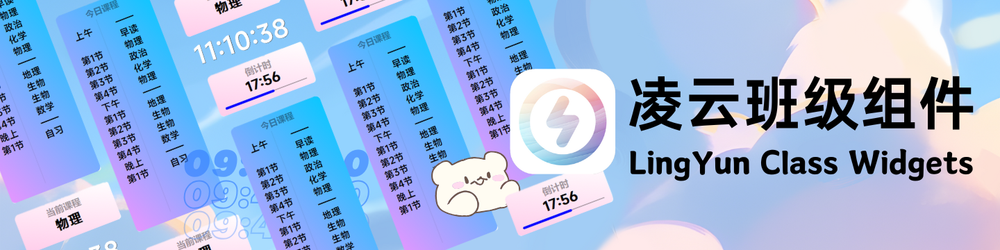
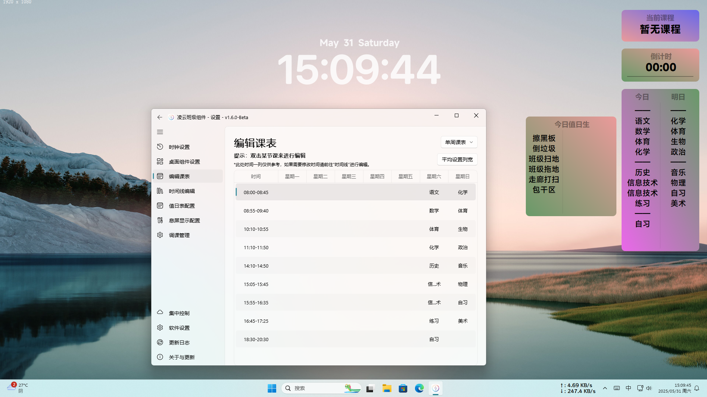
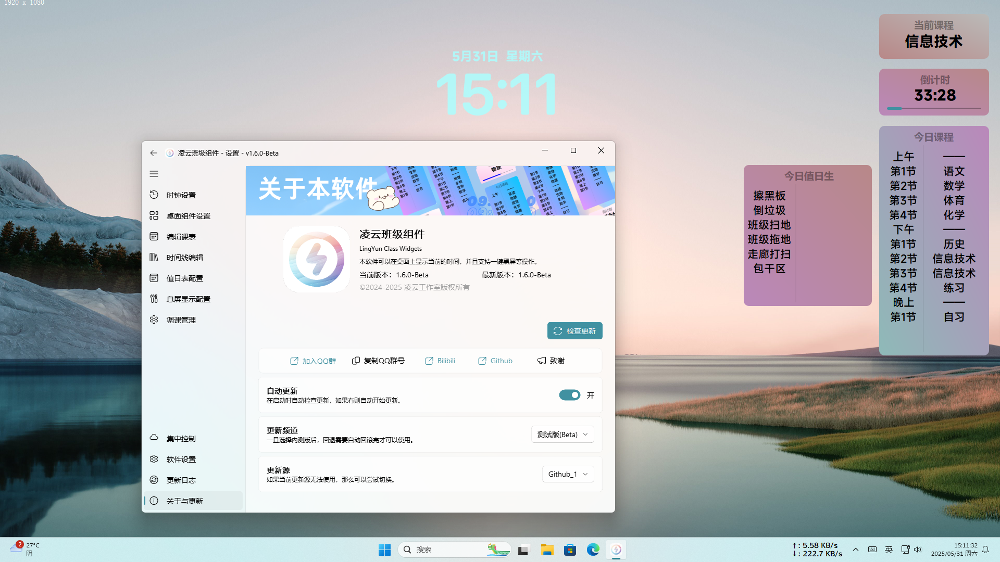
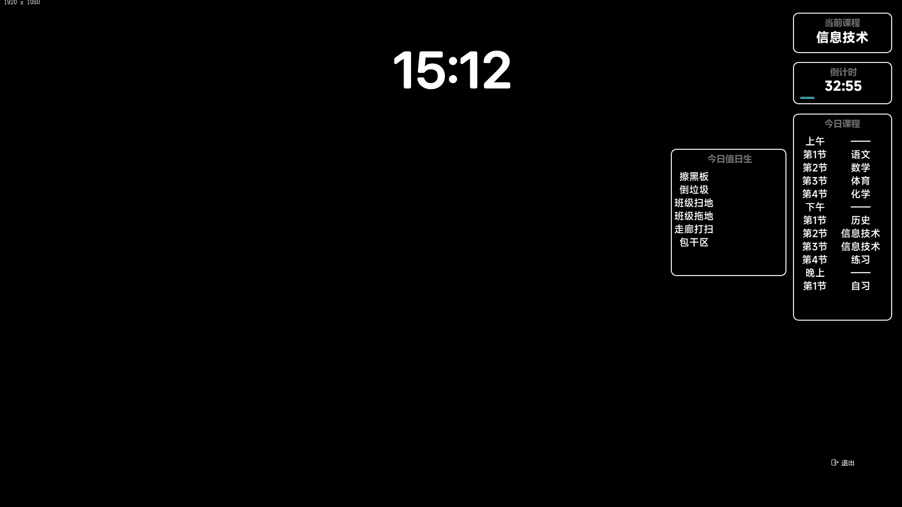
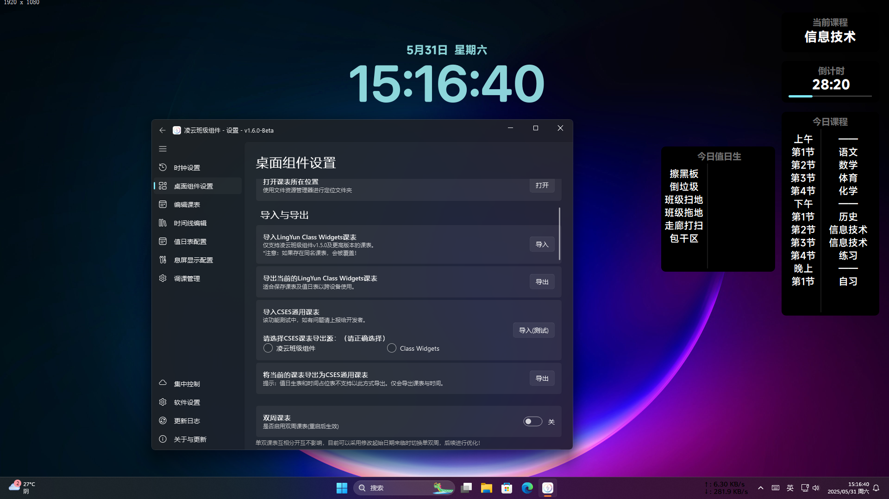

# 凌云班级组件 LingYun Class Widgets

  
  
  
  
  
  

### 下载与使用方法
在[发行界面](https://github.com/Yamikani-Flipped/LingYun-Class-Widgets/releases)，下载最新版本，解压到合适的位置，运行 `LingYun_Class_Widgets.exe` 即可使用。

可在系统托盘中找到凌云图标，进行设置、息屏等操作。

[点击这里](https://www.yuque.com/yamikani/shrqm0/zlb4xtflki2flnw2)查看一些介绍及使用方法

##

### 本软件主要功能和特性
- 桌面显示时间、日期
- 支持展示值日表、今明日课程(需支持的UI)、倒计时已经当前课程
- 适合在自习、专注情况下使用的“息屏显示”组件
- 支持集中控制，大部分设置项均支持云同步，完善的多班管理
- 支持自动更新、手动更新，支持不同的更新频道
- 便捷的课表、时间线编辑
- 支持[**CSES通用课程表格式**](https://github.com/SmartTeachCN/CSES)（Course Schedule Exchange Schema）
- 遇到节假日等等情况的调课管理
- 上下课提醒、预备铃提醒
- 支持存储多个课表文件，并且可以快速导入导出和切换
- 自动匹配系统深浅色模式
- 软件高度定制化，大部分功能支持设置中修改
- ...

##

### 截图参考（v1.6.0-Beta）
<table border="0" cellspacing="0" cellpadding="10" style="border:none;">
  <tr style="border:none;">
    <td style="border:none;">
      
    </td>
    <td style="border:none;">
      
    </td>
  </tr>
  <tr style="border:none;">
    <td style="border:none;">
      
    </td>
    <td style="border:none;">
      
    </td>
  </tr>
</table>

##

### 相关链接

- [凌云bilibili](https://space.bilibili.com/627622081)

- [临时官网(还在建设,目前仅供查看)](https://lingyun-6e2.pages.dev/)

- [加入用户QQ交流群](https://qm.qq.com/q/KN7UVWFr6C) 或者 使用QQ群号 `917509031`

##

### 致谢的第三方app及网站
> [**Class Widgets**](https://github.com/Class-Widgets/Class-Widgets)
- 沿用了部分的ui文件（已做整改）
- 上下课、即将上课提醒的音频文件的使用
- 作品中上下课提醒中“波澜”的部分代码的使用（已在v1.6.2中弃用）

> [**Icons8**](https://icons8.com/)
- 欢迎引导界面的部分3D图片

> [**智教联盟**](https://forum.smart-teach.cn/)
- 智教联盟网站的支持和指导

##

### 开源协议
本项目 (LingYun Class Widgets) 基于 GPL-3.0 许可证，详情请参阅 [LICENSE](LICENSE) 

Copyright © 2024-2025 LingYun.

